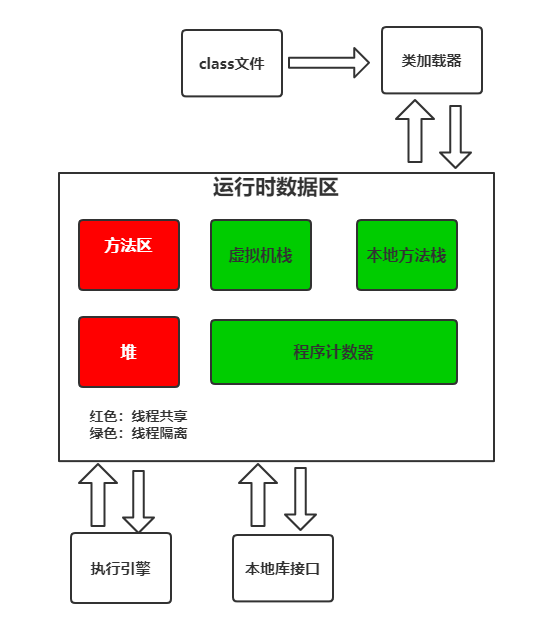

# JVM之内存模型

## 一、运行时数据区
java虚拟机在执行java程序的过程中，会把它管理的内存划分为若干个不同的数据区，这些区都有各自的用途。



#### 程序计数器
当前线程所执行的字节码的行号指示器。由于Java虚拟机的多线程是通过线程的轮流切换并分配处理器执行时间来实现的，一个处理器在一个时刻只会执行一条线程指令，因此为了线程切换后你能恢复到正确的执行位置，每个线程需要独立的程序计数器。

#### 栈
Java方法执行的内存模型，每个方法被执行的时候都会创建一个栈帧用于存储局部变量，操作栈，动态链接，方法入口等信息，每个方法被调用直至被执行完成的过程，就对应一个栈帧的入栈和出栈的过程。
* 栈溢出异常(StackOverflowError):如果线程请求的栈深度大于栈所允许的深度，将抛出栈溢出异常。
* 内存溢出(OutOfMemeryError)：当扩展是无法申请到足够多的内存时会抛出异常

#### 本地方法栈
给本地方法调用使用的栈内存

#### 堆
所有的对象实例及数组都要在堆上分配内存
* 内存溢出（OutOfMemeryError）：堆中没有内存可以完成实例分配，并且堆也无法在扩展，将会抛出outOfMemoryerror


#### 方法区

存储已被虚拟机加载的类信息，常量，静态变量，即时编译器编译后的代码等数据
* 运行时常量池：方法区的一部分

## 二、对象的生与死

#### 引用计数算法
给对象添加一个引用计数器，每当有一个地方引用它时，计数器加1，引用失效减1。主要问题很难解决循环引用的问题。

#### 跟搜索算法
通过一些GCRoots对象来作为节点，搜索所有走过的路径称为引用链，当一个对象到GCRoots没有任何引用链（在图论中即为从GCRoots到这个对象不可达），则对象时不可用的。可作为GCRoots的对象：
* 虚拟机栈中的栈帧中的本地变量表中的引用对象
* 方法区中的静态属性引用的对象
* 方法区中的常量引用对象
* 本地方法栈中的native方法的引用的对象

## 三、对象访问

#### 直接引用(强应用)
```
Object obj=new Object();
```
* object obj 在栈的本地变量中是作为一个reference类型数据出现。reference类型在虚拟机中的主流做法，是使用句柄和直接指针。
* new Object()在堆上开辟一块内存，存储object类型所有的实例数据值。
* 只要强引用还存在，垃圾回收永远不会回收被引用的对象内存

### 软引用（soft reference）
* 描述的一些还有用，但是非必须的对象。在系统将要发生内存溢出 异常之前，将会把这些对象列为回收范围之中并进行第二次回收。

### 弱引用（weak reference）
* 也是来描述非必须的对象，但是它的强度比软引用更弱一些，当垃圾回收器工作时，无论当前内存是否足够，都会回收只被弱引用关联的对象
* java中的ThreadLocal和WeakhashMap得到了应用
### 虚引用（phantom reference）
* 最弱的一种引用关系，不能通过它访问对象。幻象引用仅仅是提供了一种确保对象被 finalize 以后，做某些事情的机制，比如，通常用来做所谓的 Post-Mortem 清理机制
 
 