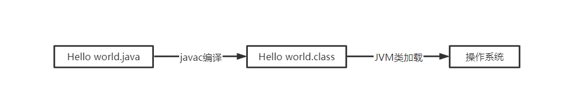

# JVM 之类加载

## 一、什么是类加载

虚拟机将类的数据从 Class 文件加载到内存的过程，称为类加载。这期间会对数据进行校验，转换解析和初始化，最终形成可以被虚拟机直接使用的 java 类型。

## 二、如何运行

### 1、加载

- 通过一个类的全限定名类获取定义此类的二进制字节流（此步骤可有 java 虚拟机外部的 classloader 实现）
- 将字节流所代表的静态存储结构转化成方法区的运行时数据结构
- 在内存中生成一个代表这个类的 java.lang.Class 对象，作为方法区这个类的各个数据的访问入口

### 2、验证

### 3、准备

### 4、解析

### 5、何时初始化：有且仅有以下五种场景会触发初始化

- 当遇到 new,getstatic,putstatic,invokestatic 这四条字节码指令时
  1. 使用 new 关键字实例化对象；
  2. 读取或设置一个类的静态字段（被 final 修饰，已经在编译器把结果放入常量池的静态字段除外）；
  3. 调用一个类的静态方法时；
- 当使用 java.lang.reflect 包的方法对类进行反射调用的时候（如类此前没有初始化过则需执行初始化）
- 当初始化一个类的时候，如果发现其父类还没有进行过初始化，则触发父类的初始化
- 当虚拟机启动时，用户需要指定一个要执行的主类（如包含 main()方法的那个主类），虚拟机会先初始化这个主类
- JDK1.7 及之后版本，如果一个 Java。lang.invoke.MethodHandle 实例最后解析结果 REF_getStatic、REF_putstatic、REF_invokeStatic 的方法句柄，并且这些方法句柄所对应的类没有进行过初始化，则先触发其初始化

## 三、双亲委派模型
