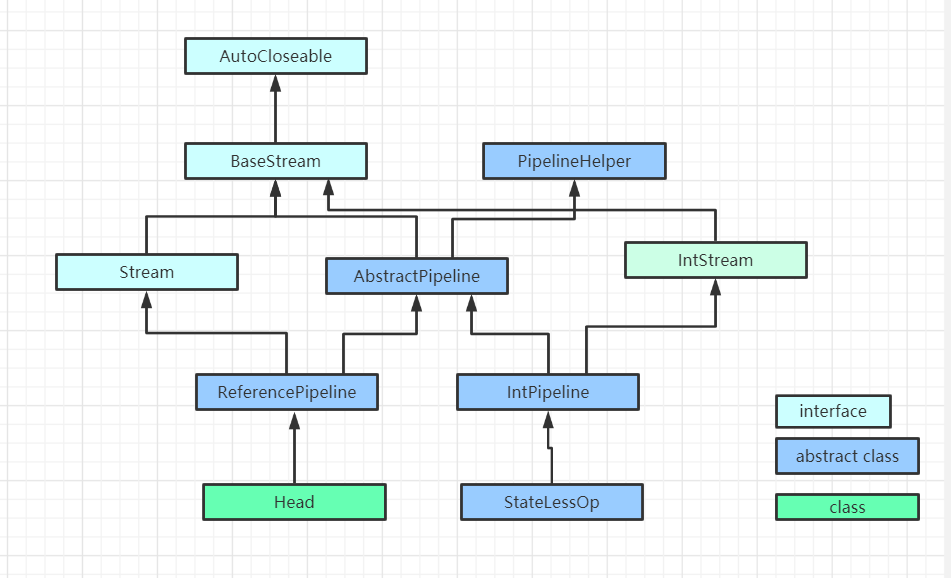
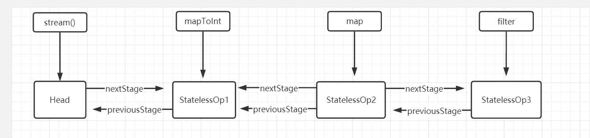
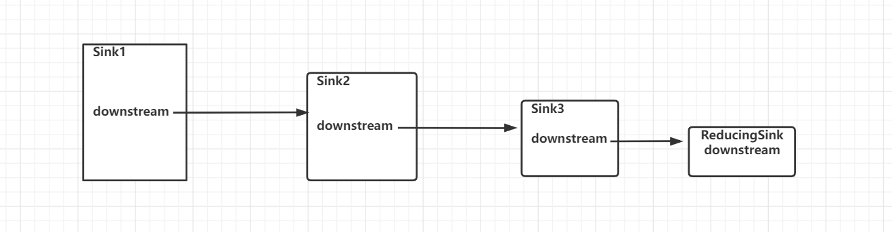

# 浅谈java Stream Api原理

## 举例
```
 List<String> list = new ArrayList<>();
        list.add("3");
        list.add("2");
        list.add("1");
        list.add("4");
        list.add("6");
        list.add("5");

        int max = list.stream()
                .mapToInt(Integer::valueOf)
                .map(v->v*3)
                .filter(value -> value>10)
                .max().getAsInt();
```


## 原理
1. 类继承关系

2. 双向链表
> AbstractPipeline有两个构造方法，方法一为stream()最终实例化ReferencePipeline调用的构造器，方法二为mapToInt，map，filter调用的构造器。
```
AbstractPipeline(Spliterator<?> source,
                     int sourceFlags, boolean parallel) {
        this.previousStage = null;
        this.sourceSpliterator = source;
        this.sourceStage = this;
        this.sourceOrOpFlags = sourceFlags & StreamOpFlag.STREAM_MASK;
       
        this.combinedFlags = (~(sourceOrOpFlags << 1)) & StreamOpFlag.INITIAL_OPS_VALUE;
        this.depth = 0;
        this.parallel = parallel;
    }

   AbstractPipeline(AbstractPipeline<?, E_IN, ?> previousStage, int opFlags) {
        if (previousStage.linkedOrConsumed)
            throw new IllegalStateException(MSG_STREAM_LINKED);
        previousStage.linkedOrConsumed = true;
        previousStage.nextStage = this;

        this.previousStage = previousStage;
        this.sourceOrOpFlags = opFlags & StreamOpFlag.OP_MASK;
        this.combinedFlags = StreamOpFlag.combineOpFlags(opFlags, previousStage.combinedFlags);
        this.sourceStage = previousStage.sourceStage;
        if (opIsStateful())
            sourceStage.sourceAnyStateful = true;
        this.depth = previousStage.depth + 1;
    }
```
>通过构造器结合下图可以看出，执行filter之后返回了StatelessOp3，而StatelessOp3的nextStage指向了StatelessOp3，以此类推形成了一个双向链表。

3. 递归
>下面代码即为当执行max()时，会反向遍历上面的由AbstractPipeline构成的双向链表，同时构造Sink的递归对象。
```
 @Override
    @SuppressWarnings("unchecked")
    final <P_IN> Sink<P_IN> wrapSink(Sink<E_OUT> sink) {
        Objects.requireNonNull(sink);

        for ( @SuppressWarnings("rawtypes") AbstractPipeline p=AbstractPipeline.this; p.depth > 0; p=p.previousStage) {
            sink = p.opWrapSink(p.previousStage.combinedFlags, sink);
        }
        return (Sink<P_IN>) sink;
    }
```


