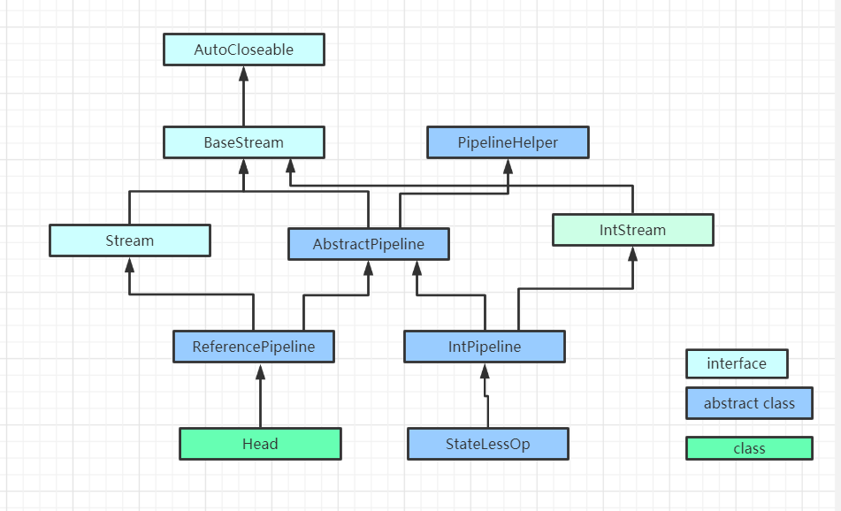

# 浅谈 java Stream Api 原理

## 举例

```java
 List<String> list = new ArrayList<>();
        list.add("3");
        list.add("2");
        list.add("1");
        list.add("4");
        list.add("6");
        list.add("5");

        int max = list.stream()
                .mapToInt(Integer::valueOf)
                .map(v->v*3)
                .filter(value -> value>10)
                .max().getAsInt();
```

## 原理

1. 类继承关系
   
2. 双向链表
   > AbstractPipeline 有两个构造方法，方法一为 stream()最终实例化 ReferencePipeline 调用的构造器，方法二为 mapToInt，map，filter 调用的构造器。

```java
AbstractPipeline(Spliterator<?> source,
                     int sourceFlags, boolean parallel) {
        this.previousStage = null;
        this.sourceSpliterator = source;
        this.sourceStage = this;
        this.sourceOrOpFlags = sourceFlags & StreamOpFlag.STREAM_MASK;

        this.combinedFlags = (~(sourceOrOpFlags << 1)) & StreamOpFlag.INITIAL_OPS_VALUE;
        this.depth = 0;
        this.parallel = parallel;
    }

   AbstractPipeline(AbstractPipeline<?, E_IN, ?> previousStage, int opFlags) {
        if (previousStage.linkedOrConsumed)
            throw new IllegalStateException(MSG_STREAM_LINKED);
        previousStage.linkedOrConsumed = true;
        previousStage.nextStage = this;

        this.previousStage = previousStage;
        this.sourceOrOpFlags = opFlags & StreamOpFlag.OP_MASK;
        this.combinedFlags = StreamOpFlag.combineOpFlags(opFlags, previousStage.combinedFlags);
        this.sourceStage = previousStage.sourceStage;
        if (opIsStateful())
            sourceStage.sourceAnyStateful = true;
        this.depth = previousStage.depth + 1;
    }
```

> 通过构造器结合下图可以看出，执行 filter 之后返回了 StatelessOp3，而 StatelessOp3 的 nextStage 指向了 StatelessOp3，以此类推形成了一个双向链表。
>  3. 递归
> 下面代码即为当执行 max()时，会反向遍历上面的由 AbstractPipeline 构成的双向链表，同时构造 Sink 的递归对象。

```java
 @Override
    @SuppressWarnings("unchecked")
    final <P_IN> Sink<P_IN> wrapSink(Sink<E_OUT> sink) {
        Objects.requireNonNull(sink);

        for ( @SuppressWarnings("rawtypes") AbstractPipeline p=AbstractPipeline.this; p.depth > 0; p=p.previousStage) {
            sink = p.opWrapSink(p.previousStage.combinedFlags, sink);
        }
        return (Sink<P_IN>) sink;
    }
```


