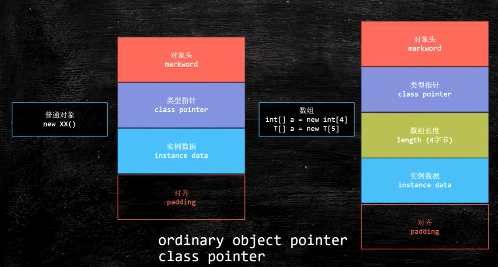
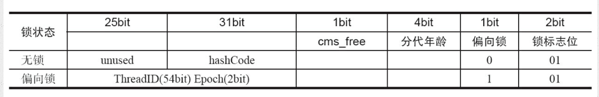
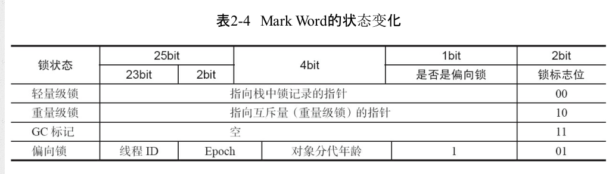
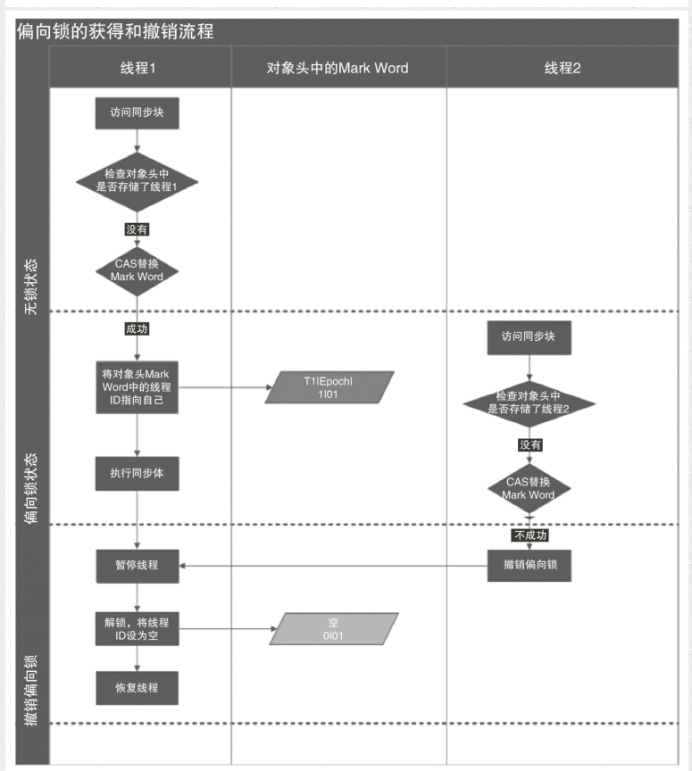
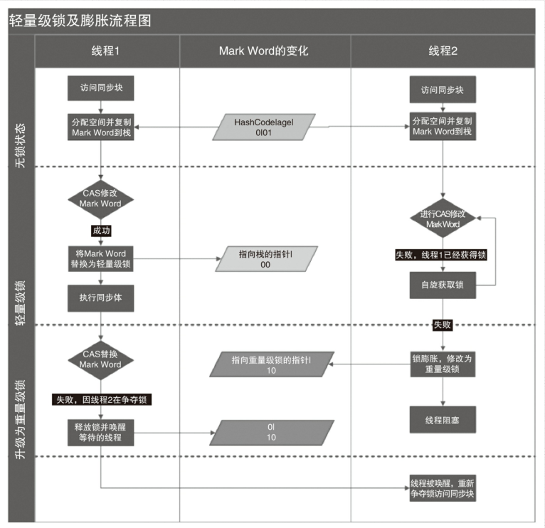
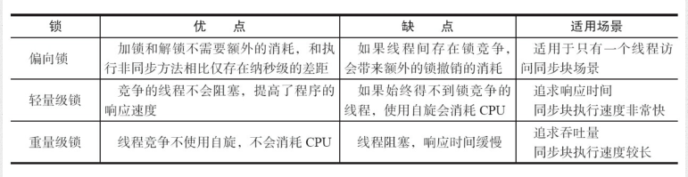

# 并发底层原理篇

## 1.线程的生命周期

#### 什么是线程
现代操作系统在运行一个程序时，会为其创建一个进程。例如，启动一个Java程序，操作
系统就会创建一个Java进程。现代操作系统调度的最小单元是线程，也叫轻量级进程（Light
Weight Process），在一个进程里可以创建多个线程，这些线程都拥有各自的计数器、堆栈和局
部变量等属性，并且能够访问共享的内存变量。处理器在这些线程上高速切换，让使用者感觉
到这些线程在同时执行

#### java线程的6种状态
|状态名称|状态名称|说明|
|-      |-   |-      |
|new|初始状态|线程被创建，但是还没有调用start方法 |
|runnable|运行状态|java线程将操作系统中的就绪和运行状态笼统地称为“运行中”|
|blocked|阻塞状态|表示线程阻塞于锁|
|waiting|等待状态|线程进入等待状态，表示当前线程需要等待其他线程做出一些特定动作（通知或中断）|
|time_waiting|超时等待状态|表示可以在指定时间自行返回的|
|terminated|终止状态|表示当前线程已经执行完毕|

## 2.synchronized

#### synchronize用法
利用synchronized实现同步的基础：java中每一个对象都可以作为锁，具体表现为以下三种形式：
- 普通同步方法：锁是当前实例的对象
- 静态同步方法：锁的是当前类的Class对象
- 同步方法块：锁的是synchronized括号里配置的对象


#### synchronize底层语义原理
理解synchronized首先需要了解一下java对象的内存结构，如图：


java对象的内存模型主要分为三部分(长度区分32位和64位操作系统)
|长度|内容|说明|
|---|---|---|
|32bit/64bit| markword|对象头，存储对象的hashCode或锁信息|
|32bit/64bit| class metadata address|对象类型数据的指针|
|32bit/64bit| instance data|实例数据|
|不确定| padding|对齐|

markword在64位JVM下的存储结构


markword的状态变化


## 3.锁的升级
java1.6为了减少获得和释放带来的性能消耗，引入了偏向锁和轻量级锁，在java1.6中，锁一共有四种状态，级别从低到高依次是：无锁状态，偏向锁，轻量级锁和重量级锁，这几种状态会随着竞争逐渐升级，锁可以升级但不能降级。

#### 1.偏向锁
HotSpot [1] 的作者经过研究发现，大多数情况下，锁不仅不存在多线程竞争，而且总是由同
一线程多次获得，为了让线程获得锁的代价更低而引入了偏向锁。当一个线程访问同步块并
获取锁时，会在对象头和栈帧中的锁记录里存储锁偏向的线程ID，以后该线程在进入和退出
同步块时不需要进行CAS操作来加锁和解锁，只需简单地测试一下对象头的Mark Word里是否
存储着指向当前线程的偏向锁。如果测试成功，表示线程已经获得了锁。如果测试失败，则需
要再测试一下Mark Word中偏向锁的标识是否设置成1（表示当前是偏向锁）：如果没有设置，则
使用CAS竞争锁；如果设置了，则尝试使用CAS将对象头的偏向锁指向当前线程

- 偏向锁的撤销:偏向锁使用了一种等到竞争出现才释放锁的机制，所以当其他线程尝试竞争偏向锁时，
持有偏向锁的线程才会释放锁。偏向锁的撤销，需要等待全局安全点（在这个时间点上没有正
在执行的字节码）。它会首先暂停拥有偏向锁的线程，然后检查持有偏向锁的线程是否活着，
如果线程不处于活动状态，则将对象头设置成无锁状态；如果线程仍然活着，拥有偏向锁的栈
会被执行，遍历偏向对象的锁记录，栈中的锁记录和对象头的Mark Word要么重新偏向于其他
线程，要么恢复到无锁或者标记对象不适合作为偏向锁，最后唤醒暂停的线程。图2-1中的线
程1演示了偏向锁初始化的流程，线程2演示了偏向锁撤销的流程。



- 关闭偏向锁：偏向锁在Java 6和Java 7里是默认启用的，但是它在应用程序启动几秒钟之后才激活，如有必要可以使用JVM参数来关闭延迟：-XX:BiasedLockingStartupDelay=0。如果你确定应用程
序里所有的锁通常情况下处于竞争状态，可以通过JVM参数关闭偏向锁：-XX:-
UseBiasedLocking=false，那么程序默认会进入轻量级锁状态。

#### 2.轻量级锁
- 轻量级锁加锁：线程在执行同步块之前，JVM会先在当前线程的栈桢中创建用于存储锁记录的空间，并
将对象头中的Mark Word复制到锁记录中，官方称为Displaced Mark Word。然后线程尝试使用
CAS将对象头中的Mark Word替换为指向锁记录的指针。如果成功，当前线程获得锁，如果失
败，表示其他线程竞争锁，当前线程便尝试使用自旋来获取锁。
- 轻量级锁解锁：轻量级解锁时，会使用原子的CAS操作将Displaced Mark Word替换回到对象头，如果成功，则表示没有竞争发生。如果失败，表示当前锁存在竞争，锁就会膨胀成重量级锁。图2-2是
两个线程同时争夺锁，导致锁膨胀的流程图。


因为自旋会消耗CPU，为了避免无用的自旋（比如获得锁的线程被阻塞住了），一旦锁升级
成重量级锁，就不会再恢复到轻量级锁状态。当锁处于这个状态下，其他线程试图获取锁时，
都会被阻塞住，当持有锁的线程释放锁之后会唤醒这些线程，被唤醒的线程就会进行新一轮
的夺锁之争

#### 锁的优缺点对比 


## 4.volatile

#### volatile修饰的变量具有可见性
- 会引起处理器缓存回写到内存
- 个处理器的缓存回写到内存会导致其他处理器的缓存无效

#### volatile禁止指令重排序（保证一致性）
指令重排是指处理器为了提高程序运行效率，可能会对输入代码进行优化，它不保证各个语句的执行顺序同代码中的顺序一致，但是它会保证程序最终执行结果和代码顺序执行的结果是一致的。指令重排序不会影响单个线程的执行，但是会影响到线程并发执行的正确性。
程序执行到volatile修饰变量的读操作或者写操作时，在其前面的操作肯定已经完成，且结果已经对后面的操作可见，在其后面的操作肯定还没有进行


## 5.cas操作,unsafe类和原子类

#### CAS操作
cas是一种乐观锁的实现方式，在juc包中有大量的应用，如：AtomicInteger

```
private static final jdk.internal.misc.Unsafe U = jdk.internal.misc.Unsafe.getUnsafe();

public final int incrementAndGet() {
        return U.getAndAddInt(this, VALUE, 1) + 1;
}
```
其中我们可以看到最终的cas操作是交给unsafe来实现的。

#### unsafe类

#### 原子类


## 6.AbstractQueuedSynchronizer

juc包中的应用
* ReentrantLock
* Semaphore
* CountDownLatch
* ThreadPoolExecutor.Worker
