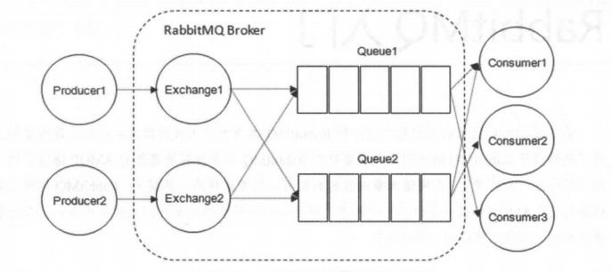
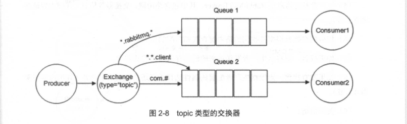

# RabbitMQ 之基础篇

## 一、整体架构

## 二、相关概念

### broker

> 消息中间件的服务节点

### producer

> 生产者，投递消息的一方

### consumer

> 消费者，接收消息的一方
> prefetch ：预取默认值

### 连接

- connection:消费者和生产者需要与 broker 建立 TCP 连接，也就是 connection
- channel:AMQP 信道，每个信道都会被指派一个唯一的 ID,信道是建立在 connection 之上的虚拟连接，每一条 AMQP 指令都是通过信道完成的。TCP 连接的建立和销毁是非常昂贵的开销，信道相当于轻量级连接，基于 NIO 实现，

### queue:队列

- rabbitmq 的内部对象，用于存储消息。rabbitmq 中的消息只能存储在队列中。
- 多个消费者可以订阅同一个队列，这时队列中的消息会被平均分摊（Round-Robin,及轮询）给多个消费者，而不是每个消费者都收到所有的消息。
- rabbitmq 不支持队列层面上的广播消费。

### exchange：交换机

> 生产者将消息发送到交换器，由交换器将消息路由到一个或多个队列中。
>
> - direct:此类型交换器会将消息投递到，routingKey 和 bindingKey 完全相同的队列中。
> - fanout:它会把所有发送到该交换器的消息路由到所有与该交换器绑定的队列中。
> - topic:routingKey 和 bindingKey 会按照一定的规则匹配,消息会被发送到匹配中的队列上去。规则如下
>   bindingKey 中可以存在两种特殊字符*和#,*用于匹配一个单词，#用于匹配多个单词。
>   
> - headers:不根据路由键匹配规则来路由消息，而是根据发送消息内容中的 headers 属性进行匹配。此类型交换器性能较差，使用较少。

### 路由与绑定

- routingKey:路由键，生产者将消息发送给交换器，一般会指定一个 routingKey,用于指定消息的路由规则。
- bindingKey:用于将交换器和队列绑定。

### 命名空间

- vhost:
  - virtual host 只是起到一个命名空间的作用，所以可以多个 user 共同使用一个 virtual host，文章开头写的 vritual_host = '/'，这个是系统默认的。
  - vhost 是 rabbitmq 分配权限的最小细粒度,比如我们可以为一个用户分配一个可以访问哪个或者哪一些 vhost 的权限,但是不能为用户分配一个可以访问哪一些 exchange，或者 queue 的权限，因为 rabbitmq 的权限细粒度没有细化到交换器和队列，他的最小细粒度是 vhost(vhost 中包含许多的 exchanges，queues，bingdings).所以如果 exchangeA 和 queueA 只能让用户 A 访问，exchangeB 和 queueB 只能让用户 B 访问，要达到这种需求，只能为 exchangeA 和 queueA 创建一个 vhostA，为 exchangeB 和 queueB 创建 vhostB，这样就隔离开来了。
  - 一个 broker 可以开设多个 vhost，用于不同用户的权限分离.

## 三、流转过程

## 四、AMQP 协议
