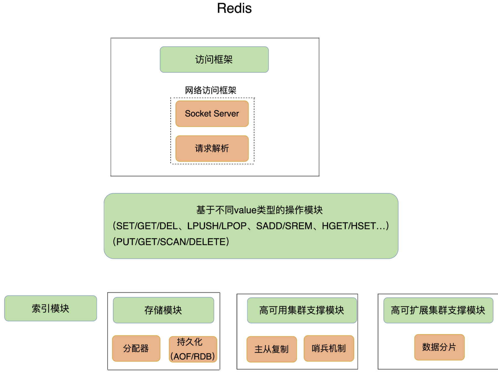
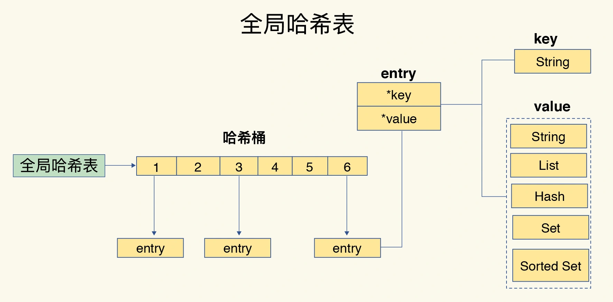
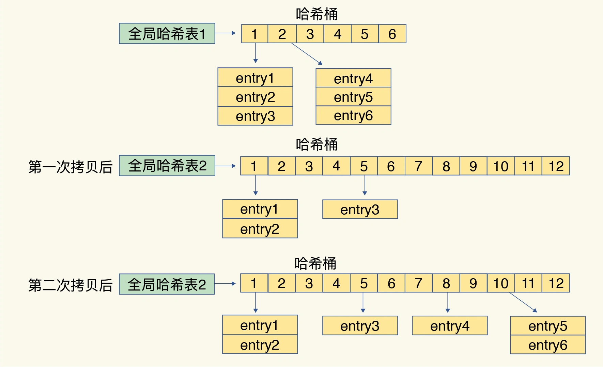
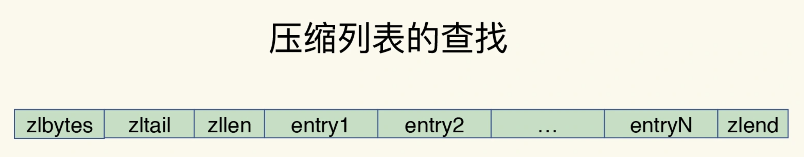
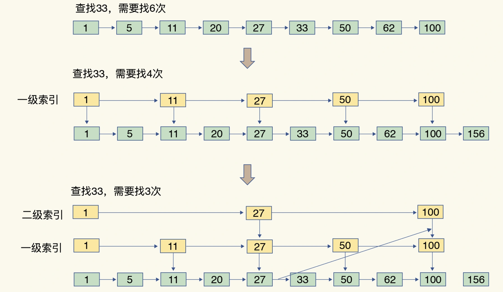

# Redis 基础篇

1. [基础架构](#1)
2. [数据类型](#2)
3. [高性能 IO 模型](#3)
4. [持久化](#4)
5. [过期策略和内存淘汰策略](#5)

## 一、基本架构

## 二、数据类型

### 1、Redis 支持的数据类型与底层数据类型的对应关系

- String：简单动态字符串
- List：双向链表和压缩列表
- Hash：哈希表和压缩列表
- Sorted Set（Zset）：跳表和压缩列表
- Set：整数数组

### 2、 键和值如何组织

1.  全局哈希表：Redis 使用一个全局哈希表保存所有的键值对,哈希桶中的 Entry 保存的是 key 和 value 的指针；
    
2.  哈希冲突：当出现哈希冲突时，渐进式 rehash 到新的更大哈希表；
    - 扩容：扩容哈希表 2（Redis 默认使用了两个全局哈希表：哈希表 1 和哈希表 2）
    - 再哈希+拷贝：将哈希表 1 中的数据 rehash 后拷贝到哈希表 2 中，这个过程不是一次性全部做完，而是一种渐进式的方式进行。在此期间，Redis 仍然正常处理客户端请求，每处理一个请求时，从哈希表 1 中的第一个索引位置开始，顺带着将这个索引位置上的所有 entries 拷贝到哈希表 2 中；等处理下一个请求时，再顺带拷贝哈希表 1 中的下一个索引位置的 entries 以此类推。如下图：
    - 释放：释放哈希表 1 的空间
      
3.  思考：redis 和 hashmap 解决哈希冲突的优劣
    hashMap 采用链表或红黑树解决哈希冲突，到达一定的阈值才扩容，而 Redis 采用直接 rehash 后拷贝到新空间。本质上，Redis 作为内存数据库其定位就是快，所以其思路是空间换时间，且 Redis 哈希表中的数据通相较于 HashMap 要大的多，冲突导致的链表势必会很长，且单线程操作不存在并发问题。Hashmap 其实是牺牲了少量的查询时间（链表 O（N）和红黑树 O（logN）），从而避免了频繁的扩容，多线程环境下异常的概率更高。

### 3、特殊数据类型

1.  压缩列表：zipList
    > 压缩列表实际上类似于一个数组，数组中的每一个元素都对应保存一个数据。和数组不同的是，压缩列表在表头有三个字段 zlbytes、zltail 和 zllen，分别表示列表长度、列表尾的偏移量和列表中的 entry 个数；压缩列表在表尾还有一个 zlend，表示列表结束。 
2.  跳表：skipList
    > 有序链表只能逐一查找元素，导致操作起来非常缓慢，于是就出现了跳表。具体来说，跳表在链表的基础上，增加了多级索引，通过索引位置的几个跳转，实现数据的快速定位， 如下图所示.
3.  几种数据类型间的时间复杂度
    1. 哈表表：O（1）
    2. 跳表：O（logN）
    3. 双向链表，压缩列表，整数数组：O（N）

## 三、高性能 IO 模型

### 1、 多线程的问题

    - 多线程编程模式面临的共享资源的并发访问控制问题：多线程操作List类型如果不加锁，会产生异常，加了锁会降低系统吞吐。

### 2、单线程为什么那么快

    - 基于内存：
    - 非CPU密集型任务
    - 数据接口：哈希表，跳表的时间复杂度低
    - IO多路复用

### 3、Redis 基于多路复用的高性能 IO 模型

## 四、持久化

### 1、AOF 日志

#### a、记录时机：先执行命令后写日志

#### b、日志形式：已追加的方式记录命令

#### c、写入策略：appendfsync 的三个可选值。

> - Always：同步写回：每个写命令执行完，立马同步地将日志写回磁盘；
> - Everysec：每秒写回：每个写命令执行完，只是先把日志写到 AOF 文件的内存缓冲区，每隔一秒把缓冲区中的内容写入磁盘；
> - No：操作系统控制的写回：每个写命令执行完，只是先把日志写到 AOF 文件的内存缓冲区，由操作系统决定何时将缓冲区内容写回磁盘

### d、写入策略如何选择

> 想要获得高性能，就选择 No 策略；如果想要得到高可靠性保证，就选择 Always 策略；如果允许数据有一点丢失，又希望性能别受太大影响的话，那么就选择 Everysec 策略。

### e、AOF 日志重写：解决日志文件过大问题

> 每次 AOF 重写时，Redis 会先执行一个内存拷贝，用于重写；然后，使用两个日志保证在重写过程中，新写入的数据不会丢失。而且，因为 Redis 采用额外的线程进行数据重写，所以，这个过程并不会阻塞主线程。
> 

### 2、RDB 内存快照

#### a、快照的范围：全量快照，即将内存中的所有数据都记录到磁盘中

#### b、生成快照的方式

> - save: 在主线程中执行，回导致阻塞
> - bgsave:创建一个子进程，专门用于写入 RDB 文件，避免了主线程的阻塞，这也是 Redis RDB 文件生成的默认配置。(默认使用 bgsave)

#### c、执行快照时数据能修改吗

> 写时复制技术（Copy-On-Write, COW）：操作系统提供的机制，在执行快照的同时，正常处理写操作。bgsave 子进程是由主线程 fork 生成的，可以共享主线程的所有内存数据。bgsave 子进程运行后，开始读取主线程的内存数据，并把它们写入 RDB 文件。
>
> - 如果主线程对这些数据也都是读操作（例如图中的键值对 A），那么，主线程和 bgsave 子进程相互不影响；
> - 如果主线程要修改一块数据（例如图中的键值对 C），那么，这块数据就会被复制一份，生成该数据的副本（键值对 C’）。然后，主线程在这个数据副本上进行修改。同时，bgsave 子进程可以继续把原来的数据（键值对 C）写入 RDB 文件。

#### e、频繁快照的开销

> 1.  磁盘压力：频繁将全量数据写入磁盘，会给磁盘带来很大压力，多个快照竞争有限的磁盘带宽，前一个快照还没有做完，后一个又开始做了，容易造成恶性循环。
> 2.  内存压力： bgsave 子进程需要通过 fork 操作从主线程创建出来。虽然，子进程在创建后不会再阻塞主线程，但是，fork 这个创建过程本身会阻塞主线程，而且主线程的内存越大，阻塞时间越长。如果频繁 fork 出 bgsave 子进程，这就会频繁阻塞主线程了（所以，在 Redis 中如果有一个 bgsave 在运行，就不会再启动第二个 bgsave 子进程）。

### 3、AOF 和 RDB 的取舍

> 1.  数据不能丢失时，内存快照和 AOF 的混合；
> 2.  如果允许分钟级别的数据丢失，可以只使用 RDB；
> 3.  如果只用 AOF，优先使用 everysec 的配置选项，因为它在可靠性和性能之间取了一个平衡。

## 五、过期策略和内存淘汰策略

### 1、过期策略

- 定时过期：每个设置过期时间的 key 都需要创建一个定时器，到过期时间就会立即清除。该策略可以立即清除过期的数据，对内存很友好；但是会占用大量的 CPU 资源去处理过期的数据，从而影响缓存的响应时间和吞吐量。
- 惰性过期：只有当访问一个 key 时，才会判断该 key 是否已过期，过期则清除。该策略可以最大化地节省 CPU 资源，却对内存非常不友好。极端情况可能出现大量的过期 key 没有再次被访问，从而不会被清除，占用大量内存。
- 定期过期：每隔一定的时间，会扫描一定数量的数据库的 expires 字典中一定数量的 key，并清除其中已过期的 key。该策略是前两者的一个折中方案。通过调整定时扫描的时间间隔和每次扫描的限定耗时，可以在不同情况下使得 CPU 和内存资源达到最优的平衡效果。
  (expires 字典会保存所有设置了过期时间的 key 的过期时间数据，其中，key 是指向键空间中的某个键的指针，value 是该键的毫秒精度的 UNIX 时间戳表示的过期时间。键空间是指该 Redis 集群中保存的所有键。)
  Redis 中同时使用了惰性过期和定期过期两种过期策略。

### 2、内存淘汰策略

Redis 的内存淘汰策略是指在 Redis 的用于缓存的内存不足时，怎么处理需要新写入且需要申请额外空间的数据。

- noeviction：当内存不足以容纳新写入数据时，新写入操作会报错。
- allkeys-lru：当内存不足以容纳新写入数据时，在键空间中，移除最近最少使用的 key。
- allkeys-random：当内存不足以容纳新写入数据时，在键空间中，随机移除某个 key。
- volatile-lru：当内存不足以容纳新写入数据时，在设置了过期时间的键空间中，移除最近最少使用的 key。
- volatile-random：当内存不足以容纳新写入数据时，在设置了过期时间的键空间中，随机移除某个 key。
- volatile-ttl：当内存不足以容纳新写入数据时，在设置了过期时间的键空间中，有更早过期时间的 key 优先移除。

### 3、过期键删除策略和内存淘汰机制之间的关系：

> 过期健删除策略强调的是对过期健的操作，如果有健过期了，而内存还足够，不会使用内存淘汰机制，这时也会使用过期健删除策略删除过期健。
> 内存淘汰机制强调的是对内存的操作，如果内存不够了，即使有的健没有过期，也要删除一部分，同时也针对没有设置过期时间的健。
