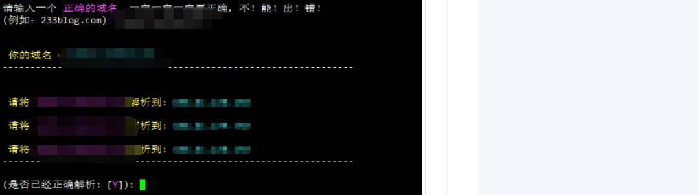
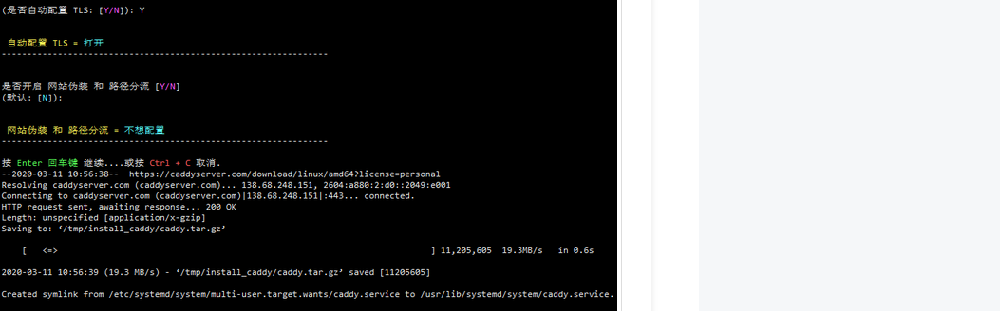
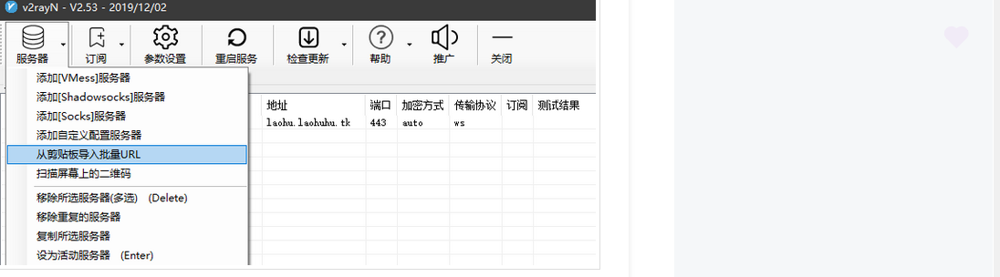

# 搭梯子

### 一、VPS
搬瓦工购买vps主机，使用本地xshell连接vps


### 二、域名
godaddy购买域名（无需备案）,不设置域名解析


### 三、cloudflare设置域名解析
* 此处需要将godaddy的nameserver替换成cloudflare的nameServer,否则会出现下图提醒。解决方法：在godaddy的DNS Management界面Nameservers中点击chage后，输入cloudflare的nameServer即可。
 
* 设置DNS:需要将小云朵点成灰色
 
* 设置ssl:证书生成有点延迟，需耐心等待;下图中status为active才时生效状态
 

### 四、配置v2ray
* 第一步：执行下面脚本
```
bash <(curl -s -L https://git.io/v2ray.sh)

```

* 第二步：选择4选项：WebSocket + TLS
 

* 第三步：配置代理域名
 

 
* 第四步：安装caddy,按Y继续
 

  
* 第五步：是否开启网站伪装和路径分流，默认否；选择后开始自动安装
 


* 第五步：安装完成后会自动打开v2ray配置信息
 

### 五、使用客户端代理
* 输入v2ray url生成vmess链接，copy链接
 
 * 导入vmess连接
  
* 到这里梯子就搭建成功。