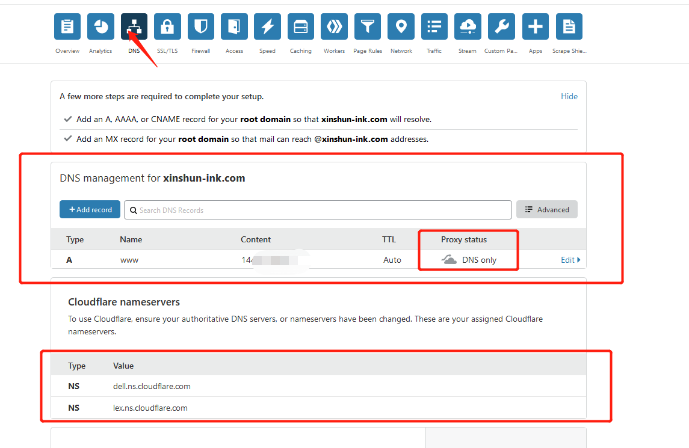

# 科学上网

### 一、VPS

搬瓦工购买 vps 主机，使用本地 xshell 连接 vps

### 二、域名

godaddy 购买域名,不设置域名解析

### 三、cloudflare 设置域名解析

- 此处需要将 godaddy 的 nameserver 替换成 cloudflare 的 nameServer,否则会出现下图提醒。解决方法：在 godaddy 的 DNS Management 界面 Nameservers 中点击 chage 后，输入 cloudflare 的 nameServer 即可。
  
- 设置 DNS:需要将小云朵点成灰色
  
- 设置 ssl:证书生成有点延迟，需耐心等待;下图中 status 为 active 才时生效状态
  

### 四、配置 v2ray

- 第一步：执行下面脚本

```
bash <(curl -s -L https://git.io/v2ray.sh)

```

- 第二步：选择 4 选项：WebSocket + TLS
  

- 第三步：配置代理域名
  

- 第四步：安装 caddy,按 Y 继续
  
- 第五步：是否开启网站伪装和路径分流，默认否；选择后开始自动安装
  

- 第五步：安装完成后会自动打开 v2ray 配置信息
  

### 五、使用客户端代理

- 输入 v2ray url 生成 vmess 链接，copy 链接
  
- 导入 vmess 连接
  
- 到这里科学上网就 OK 了。
