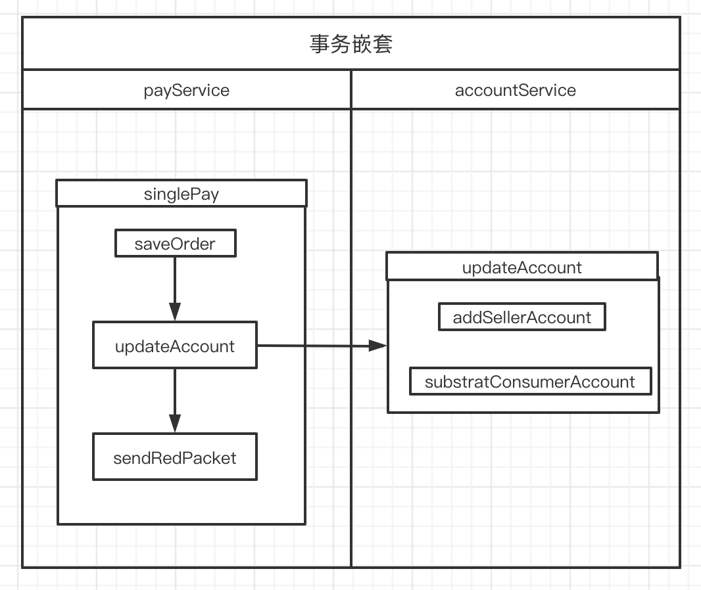

# spring 原理篇之事务管理

## 一、基本概念

### 1.事务隔离级别：是指若干个并发的事务之间的隔离程度

在一个典型的应用程序中，多个事务同时运行，经常会为了完成他们的工作而操作同一个数据。并发虽然是必需的，但是会导致以下问题：

- 脏读(Dirty read):脏读发生在一个事务读取了被另一个事务改写但尚未提交的数据时。如果这些改变在稍后被回滚了，那么第一个事务读取的数据就会是无效的.
- 不可重复读(Nonrepeatable read):不可重复读发生在一个事务执行相同的查询两次或两次以上，但每次查询结果都不相同时。这通常是由于另一个并发事务在两次查询之间更新了数据.
- 幻读(Phantom reads):幻读和不可重复读相似。当一个事务（T1）读取几行记录后，另一个并发事务（T2）插入了一些记录时，幻读就发生了。在后来的查询中，第一个事务（T1）就会发现一些原来没有的额外记录.
  TransactionDefinition 接口中定义了五个表示隔离级别的常量

| 名称             | 是否默认 | 说明                                                                                                                                                                                       |
| ---------------- | -------- | ------------------------------------------------------------------------------------------------------------------------------------------------------------------------------------------ |
| DEFAULT          | 是       | 表示使用底层数据库的默认隔离级别。对大部分数据库而言，通常这值就是 ISOLATION_REPEATABLE_READ                                                                                               |
| READ_UNCOMMITTED | 否       | 该隔离级别表示一个事务可以读取另一个事务修改但还没有提交的数据。该级别不能防止脏读和不可重复读，因此很少使用该隔离级别。                                                                   |
| READ_COMMITTED   | 否       | 该隔离级别表示一个事务只能读取另一个事务已经提交的数据。该级别可以防止脏读，这也是大多数情况下的推荐值                                                                                     |
| REPEATABLE_READ  | 否       | 该隔离级别表示一个事务在整个过程中可以多次重复执行某个查询，并且每次返回的记录都相同。即使在多次查询之间有新增的数据满足该查询，这些新增的记录也会被忽略。该级别可以防止脏读和不可重复读。 |
| SERIALIZABLE     | 否       | 所有的事务依次逐个执行，这样事务之间就完全不可能产生干扰，也就是说，该级别可以防止脏读、不可重复读以及幻读。但是这将严重影响程序的性能。通常情况下也不会用到该级别                         |

### 2.事务传播行为（为了解决业务层方法之间互相调用的事务问题）

所谓事务的传播行为是指，如果在开始当前事务之前，一个事务上下文已经存在，此时有若干选项可以指定一个事务性方法的执行行为。在 TransactionDefinition 定义中包括了如下几个表示传播行为的常量：

| 名称         | 是否默认 | 说明                                                                                                    |
| ------------ | -------- | ------------------------------------------------------------------------------------------------------- |
| required     | 是       | 如果当前存在事务，则加入该事务；如果当前没有事务，则创建一个新的事务。                                  |
| support      | 否       | 如果当前存在事务，则加入该事务；如果当前没有事务，则以非事物方式运行。                                  |
| mandatory    | 否       | 如果当前存在事务，则加入该事务；如果当前没有事务，则抛出异常。                                          |
| requires_new | 否       | 创建一个新的事务，如果当前存在事务，则把当前事务挂起                                                    |
| not_support  | 否       | 以非事务方式运行，如果当前存在事务，则把当前事务挂起                                                    |
| never        | 否       | 以非事务方式运行，如果当前存在事务，则抛出异常                                                          |
| nested       | 否       | 如果当前存在事务，则创建一个事务作为当前事务的嵌套事务来运行；如果当前没有事务，则该取值等价于 REQUIRED |

### 3.事务超时

所谓事务超时，就是指一个事务所允许执行的最长时间，如果超过该时间限制但事务还没有完成，则自动回滚事务。在 TransactionDefinition 中以 int 的值来表示超时时间，其单位是秒.

> @Transactional(timeout=30)

### 4.事务的只读属性

如果一个事务只对数据库执行读操作，那么该数据库就可能利用那个事务的只读特性，采取某些优化措施。通过把一个事务声明为只读，可以给后端数据库一个机会来应用那些它认为合适的优化措施。由于只读的优化措施是在一个事务启动时由后端数据库实施的， 因此，只有对于那些具有可能启动一个新事务的传播行为（requires_new、required、 nested）的方法来说，将事务声明为只读才有意义。

> @Transactional(readOnly=true)
> 该属性用于设置当前事务是否为只读事务，设置为 true 表示只读，false 则表示可读写，默认值为 false。

### 5.回滚规则

在默认设置下，事务只在出现运行时异常（runtime exception）时回滚，而在出现受检查异常（checked exception）时不回滚（这一行为和 EJB 中的回滚行为是一致的）。
不过，可以声明在出现特定受检查异常时像运行时异常一样回滚。同样，也可以声明一个事务在出现特定的异常时不回滚，即使特定的异常是运行时异常

- 指定单一异常类：@Transactional(rollbackFor=RuntimeException.class)
- 指定多个异常类：@Transactional(rollbackFor={RuntimeException.class, Exception.class})

### 6.@Transactional 注解属性说明

@Transactional 属性说明

| 属性名                 | 说明                         | 默认行为                         |
| ---------------------- | ---------------------------- | -------------------------------- |
| propagation            | 事务传播行为                 | Propagation.REQUIRED             |
| isolation              | 事务隔离级别                 | Isolation.DEFAULT                |
| readOnly               | 事务读写性                   | false                            |
| timeout                | 超时时间，单位秒             | -1，即无超时时间                 |
| rollbackFor            | 一组异常类，遇到时进行回滚   | 默认为{}，即所有运行时异常都会滚 |
| rollbackForClassName   | 一组异常类名，遇到时进行回滚 | 默认{}，即所有运行时异常都会滚   |
| noRollbackFor          | 一组异常类，遇到时不回滚     | 默认为{}                         |
| noRollbackForClassName | 一组异常类名，遇到时不回滚   | 默认{}                           |

## 二、事务的嵌套

这里主要套路无注解，required 类型和 requires_new 这三种类型的组合，其他 support，not_support 类型等，从上面表格中的表述就能知道其作用，在此就不讨论了。

#### 示例代码：模拟一个支付过程，1.支付单落库--->2.扣减商家和个人账户余额 3--->.给下单人发红包



#### 场景一：同一个 service 中,外层无注解，内层有注解

- 伪代码

```java
singlePay{
    ->saveOrder
    -> updateAccount(@Transactional)
}
```

- 现象：substratConsumerAccount 抛出异常，但是 addSellerAccount，saveOrder 都正常执行，不会回滚。
- 结论：事务失效，整个调用链都会以无事务方式执行

#### 场景二：不同 service 中,外层无注解，内层有注解（required 或 requires_new）

- 伪代码

```java
singlePay{
    ->saveOrder
    ->updateAccount(@Transactional)
    ->sendredPacket
}
```

- 现象：substratConsumerAccount 异常，addSellerAccount 回滚，saveOrder 不回滚。sendredPacket 异常，updateAccount 和 saveOrder 都不回滚
- 结论：此场景 required 和 requires_new 相同的效果，updateAccount 内部都会新起一个事务，外层无事务

#### 场景三：不同 service 中，外层有注解(required)，内层有注解（required）

- 伪代码

```java
singlePay(required){
    ->saveOrder
    ->updateAccount(required)
}
```

- 现象：singlePay 整个调用链在同一个事务中执行，addSellerAccount，saveOrder 数据都回滚。
- 结论：required 类型，当前如果有事务会加入事务，所以调用链在同一个事务中执行。

#### 场景四：不同 service 中，外层有注解(required)，内层有注解（requires_new）

- 伪代码

```java
singlePay(required){
    ->saveOrder
    ->updateAccount(requires_new)
    ->sendredPacket
}
```

- 现象：singlePay 和 updateAccount 分别处于不同的事务
  - sendredPacket 抛异常，外层事务会回滚，内存事务不会滚。
  - updateAccount 抛异常，两个事务都会回滚。
- 结论：required_new 类型会新起一个事务，当前如果有事务会加入事务，所以调用链中会有两个事务。

#### 场景五：不同 service 中，外层有注解(required)，内层无注解

- 伪代码

```java
singlePay(required){
    ->saveOrder
    ->updateAccount
    ->sendredPacket
}
```

- 现象：sendredPacket 抛出异常，saveOrder 和 updateAccount 都回滚
- 结论：required 类型会起一个事务，内部方法都会加入到事务中，整个调用链都是同一个事务。

#### 事务失效情况

- 同一个类中, 一个 nan-transactional 的方法去调用 transactional 的方法, 事务会失效。未加注解，调用的不是代理类，无法实现事务。
- 在非 public 方法上标注 transactional 不会被代理, 事务无效。

## 三、实现原理

#### 原理

Spring 事务管理是通过 JDK 动态代理的方式进行实现的（另一种是使用 CGLib 动态代理实现的）

[参考]（https://zhuanlan.zhihu.com/p/35483036）
