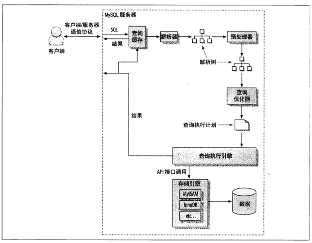

## mysql之查询优化


### 一、查询执行过程
#### 流程图
1. 高性能mysql中的执行示意图

2. 极客时间专栏mysql查询执行示意图
.png)
#### 执行过程
1. 连接器：客户端与服务器建立连接。
2. 客户端发送一条查询语句给服务器。
3. 服务器查询缓存，命中缓存，则直接返回；否则进入下一阶段。
4. 分析器：词法分析，语法分析
5. 优化器：生成执行计划，索引选择
6. 执行器：操作引擎，返回结果
7. 存储引擎：存储数据，提供读写接口


### 二、查询优化
#### count优化
* count(字段):统计满足条件的所有字段不为字段值的数量，这里是统计字段的数量，而不是行数  
* count(*)：统计结果集的行数
* count(1):在innoDB中和count(*)一样
```
InnoDB handles SELECT COUNT(*) and SELECT COUNT(1) operations in the same way. There is no performance difference.(翻译)InnoDB以同样的方式处理SELECT COUNT(*)和SELECT COUNT(1)操作。没有性能差异。
摘自mysql官方文档(https://dev.mysql.com/doc/refman/5.7/en/group-by-functions.html#function_count)
```

#### limit优化
- 常见做法：SELECT ... FROM ... WHERE ... ORDER BY ... LIMIT offset,paseSize
- 存在的问题：limit越往后分页，LIMIT语句的偏移量就会越大，例如：表的总行数为20000，执行limit 10000，20语句，就需要查询到符合条件的10020条数据，然后前10000条会被抛弃。
- 优化方案
    - 1.将limit转换成where,将第一页的最后一条数据的id,作为第二页的起始id,改写为select * from table where id > lastPageId limit pageSize,以此类推。优点：不会存在越往后翻页，性能越差。缺点：需要有自增id,同时接口外观需要由通常的pageSize,pageNo，改为pageSize,lastId.

 