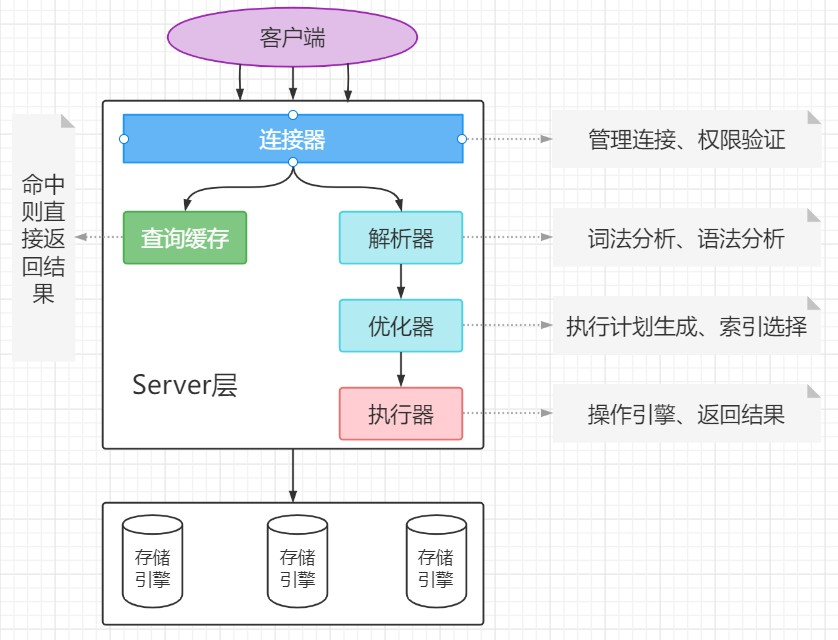

# mysql 原理篇之体系结构

## 一、mysql 体系结构

### 1、逻辑架构图

### 2、sql 执行过程

## 二、InnoDB 体系结构

### 1、内存部分

#### a、Buffer Pool:缓冲池

1. 作用：缓存表数据与索引数据，把磁盘上的数据加载到缓冲池，避免每次访问都进行磁盘 IO，起到加速访问的作用。
2. 实现：page 的链表+LRU 淘汰算法

#### b、Change Buffer

> 更改缓冲区是一种特殊的数据结构，当辅助索引页不在缓冲池中时，它会缓存这些页的更改。缓存的更改可能由插入、更新或删除操作（DML）导致，稍后当页面通过其他读取操作加载到缓冲池时，会合并这些更改。

> 备注： 在 MySQL5.5 之前，叫插入缓冲(insert buffer)，只针对 insert 做了优化；现在对 delete 和 update 也有效，叫做写缓冲(change buffer)。

#### c、Adaptive Hash Index

#### d、Log Buffer

### 2、磁盘部分

#### a、Tables

#### b、Indexs

#### c、Tablespaces

#### d、InnoDB Data Dictionary

#### e、Double write Buffer

> DoubleWrite 缓冲区是一个存储区域，其中 InnoDB 在将页面写入 InnoDB 数据文件中的正确位置之前从缓冲池中刷新页面。如果在页面写入中间有操作系统，存储子系统或意外的 MySQLD 进程退出，InnoDB 可以在崩溃恢复期间从 DoubleWrite 缓冲区找到页面的良好副本。

#### f、Redo Log

#### g、Undo Logs
