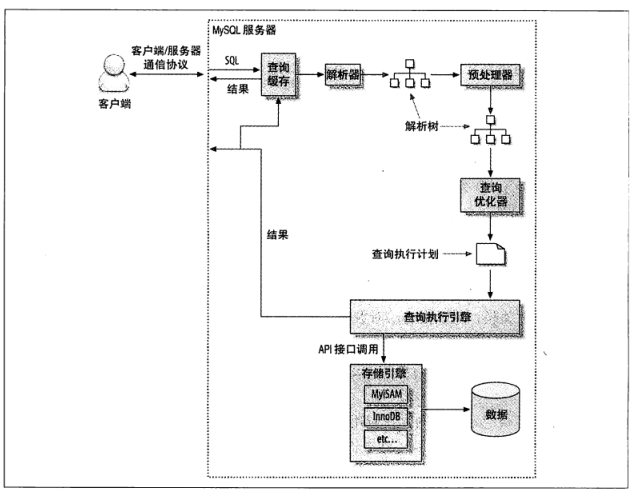

# mysql 之查询优化

### 一、查询执行过程

#### 流程图

1. 高性能 mysql 中的执行示意图
   
2. 极客时间专栏 mysql 查询执行示意图
   .png>)

#### 执行过程

1. 连接器：客户端与服务器建立连接。
2. 客户端发送一条查询语句给服务器。
3. 服务器查询缓存，命中缓存，则直接返回；否则进入下一阶段。
4. 分析器：词法分析，语法分析
5. 优化器：生成执行计划，索引选择
6. 执行器：操作引擎，返回结果
7. 存储引擎：存储数据，提供读写接口

### 二、查询优化

#### count 优化

- count(字段):统计满足条件的所有字段不为字段值的数量，这里是统计字段的数量，而不是行数
- count(\*)：统计结果集的行数
- count(1):在 innoDB 中和 count(\*)一样

```sql
InnoDB handles SELECT COUNT(*) and SELECT COUNT(1) operations in the same way. There is no performance difference.(翻译)InnoDB以同样的方式处理SELECT COUNT(*)和SELECT COUNT(1)操作。没有性能差异。
摘自mysql官方文档(https://dev.mysql.com/doc/refman/5.7/en/group-by-functions.html#function_count)
```

#### limit 优化

- 常见做法：SELECT ... FROM ... WHERE ... ORDER BY ... LIMIT offset,paseSize
- 存在的问题：limit 越往后分页，LIMIT 语句的偏移量就会越大，例如：表的总行数为 20000，执行 limit 10000，20 语句，就需要查询到符合条件的 10020 条数据，然后前 10000 条会被抛弃。
- 优化方案
  - 1.将 limit 转换成 where,将第一页的最后一条数据的 id,作为第二页的起始 id,改写为 select \* from table where id > lastPageId limit pageSize,以此类推。优点：不会存在越往后翻页，性能越差。缺点：需要有自增 id,同时接口外观需要由通常的 pageSize,pageNo，改为 pageSize,lastId.
  - 2.

### 三、查询中的索引

##### 1、联合索引

- 最左匹配原则：下面的表中，last_name,last_name|first_name,last_name|first_name|age,这个三种查询方式都能命中索引。

```sql
CREATE TABLE test (
    id         INT NOT NULL,
    last_name  CHAR(30) NOT NULL,
    first_name CHAR(30) NOT NULL,
    age int NOT NULL,
    PRIMARY KEY (id),
    INDEX name (last_name,first_name,age)
);
```

- 联合索引和多个单独索引的区别

```sql
If a multiple-column index exists on col1 and col2, the appropriate rows can be fetched directly. If separate single-column indexes exist on col1 and col2, the optimizer attempts to use the Index Merge optimization (see Section 8.2.1.3, “Index Merge Optimization”), or attempts to find the most restrictive index by deciding which index excludes more rows and using that index to fetch the rows.
如果col1和col2上存在多列索引，则可以直接获取适当的行。如果在col1和col2上存在单独的单列索引，那么优化器将尝试使用索引合并优化(请参阅8.2.1.3节，索引合并优化)，或者尝试通过确定哪个索引排除了更多的行并使用该索引获取行来找到限制最严格的索引
```

> 如果使用多个单独索引代替联合索引，优化器将尝试使用索引合并优化，或者尝试通过确定哪个索引排除了更多的行并使用该索引获取行来找到限制最严格的索引

#### 2、无法命中索引的几种情况

- 模糊查询 like '%a'或者 like '%a%'
- 如果列类型是字符串，那一定要在条件中将数据使用引号引用起来,否则不使用索引
- 没有查询条件，或者查询条件没有建立索引
- 查询条件中，在索引列上使用函数（+, - ,\*,/）, 这种情况下需建立函数索引
- 采用 not in, not exist
- B-tree 索引 is null 不会走， is not null 会走
- 连接查询时，如果关联字段的的编码不同，也不会走索引。如一个表时 utf8，另外一个表是 utf8mb4
